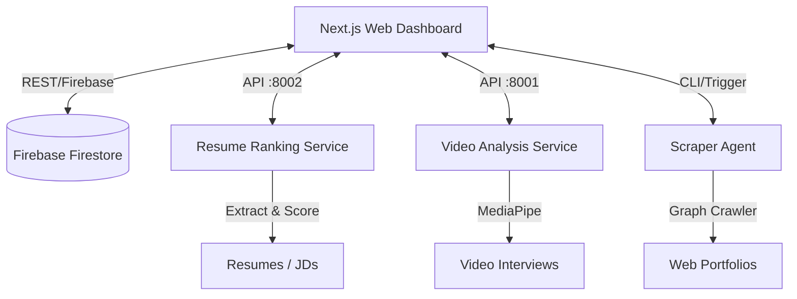

<div align="center">
  <h1>🚀 DeepScreen</h1>
  <p><strong>The AI-Native, Multi-Agent Recruitment & ATS Platform</strong></p>

  <p>
    <a href="https://nextjs.org/"></a>
    <a href="https://fastapi.tiangolo.com/"></a>
    <a href="https://python.org"></a>
    <a href="https://react.dev/"></a>
    <a href="https://tailwindcss.com/"></a>
  </p>
</div>

---

**DeepScreen** is a next-generation Applicant Tracking System (ATS) that leverages a swarm of AI agents to autonomously evaluate candidates. It goes beyond keyword matching by performing semantic resume ranking, deep web auditing of candidate portfolios, and biometric-aware video interview analysis.

## ✨ Key Features

- 🧠 **Gen4 ATS Ranking**: Semantic matching and LLM-powered Merge Sort ranking to find the perfect fit between resumes and Job Descriptions.
- 🕷️ **Intelligent Web Auditor**: An autonomous agent that crawls candidate portfolios and GitHub/LinkedIn profiles to verify technical claims.
- 🎥 **Video Behavioral Analysis**: Analyzes facial landmarks, engagement, and communication skills during video interviews using MediaPipe and AI.
- 📊 **Unified HR Dashboard**: A beautiful, real-time Next.js 16 interface with Radix UI, managed via Firebase.
- ⚡ **Microservice Architecture**: Fully decoupled FastAPI backends for processing scalability.

## 🏗️ Architecture

DeepScreen operates on a decoupled microservices architecture, allowing each AI agent to scale independently.



## 📂 Project Structure

```text
DeepScreen/
├── web/                  # Next.js 16 Frontend (Dashboard)
│   ├── app/              # React Server Components & Routing
│   ├── components/       # Radix UI & Tailwind Components
│   └── lib/              # Firebase & API clients
├── Resume_Ranking/       # FastAPI Service (Port 8002)
│   ├── llm_ranking.py    # LLM Merge Sort Algorithm
│   └── main.py           # ATS Endpoints
├── Scraper_Agent/        # Autonomous Web Crawler
│   ├── audit_graph.py    # LangGraph State Machine
│   └── main.py           # CLI Entrypoint
└── Video_Analysis/       # FastAPI Service (Port 8001)
    ├── facial_analysis.py# MediaPipe Face Landmarker
    └── main.py           # Stateless Video Processing
```

## 🚀 Quick Start

### Prerequisites

- Node.js >= 18.x
- Python >= 3.10
- Firebase Project configured
- `uv` Package Manager (Recommended for Python)

### 1. Resume Ranking Service (Backend)

Navigate to the `Resume_Ranking` directory and start the FastAPI service:

```bash
cd Resume_Ranking
# Install dependencies from root
pip install -r ../requirements.txt
# Run the server
uvicorn main:app --host 0.0.0.0 --port 8002 --reload
```

### 2. Video Analysis Service (Backend)

Navigate to the `Video_Analysis` directory and start the video processing API:

```bash
cd Video_Analysis
# Ensure MediaPipe models are downloaded
uvicorn main:app --host 0.0.0.0 --port 8001 --reload
```

### 3. Next.js Dashboard (Frontend)

Navigate to the `web` directory to boot up the HR dashboard:

```bash
cd web
npm install
npm run dev
```

The application will be accessible at `http://localhost:3000`.

## 🔐 Configuration & Environment Variables

DeepScreen relies on external APIs. We have provided example environment files that you can use as a template.

1. **Root Backend Configuration**:
   Copy the `.env.example` file in the root directory to `.env` and fill in your keys:
   ```bash
   cp .env.example .env
   ```

2. **Frontend Configuration**:
   Navigate to the `web` directory, copy `.env.local.example` to `.env.local`, and fill in your Firebase details:
   ```bash
   cd web
   cp .env.local.example .env.local
   ```

*Note: For Firebase Admin SDK access in Python, ensure `serviceAccountKey.json` is placed in the root directory.*

## 🛡️ Security & Privacy

DeepScreen processes sensitive PII (Personally Identifiable Information). 
- **Stateless Video Processing**: The video analysis service processes files in temporary storage and purges them immediately after execution.
- **Secure Credentials**: All API keys and Firebase credentials must be ignored via `.gitignore`.

---
<div align="center">
  <i>Built with ❤️ for the future of HR technology.</i>
</div>
