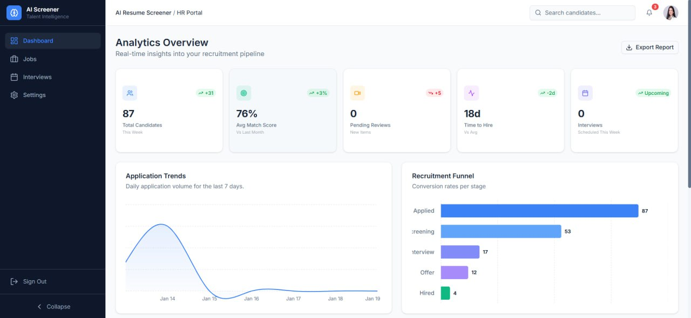
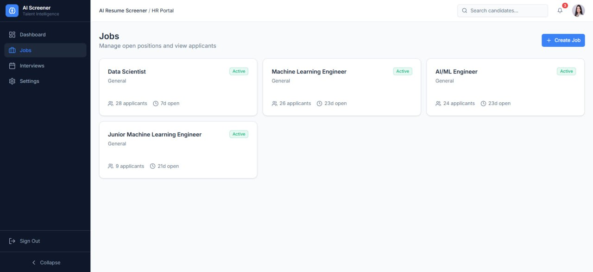
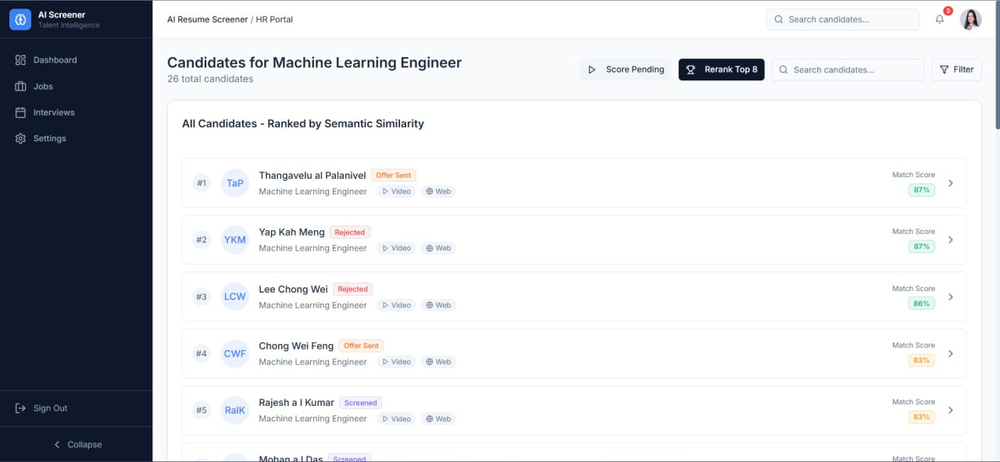
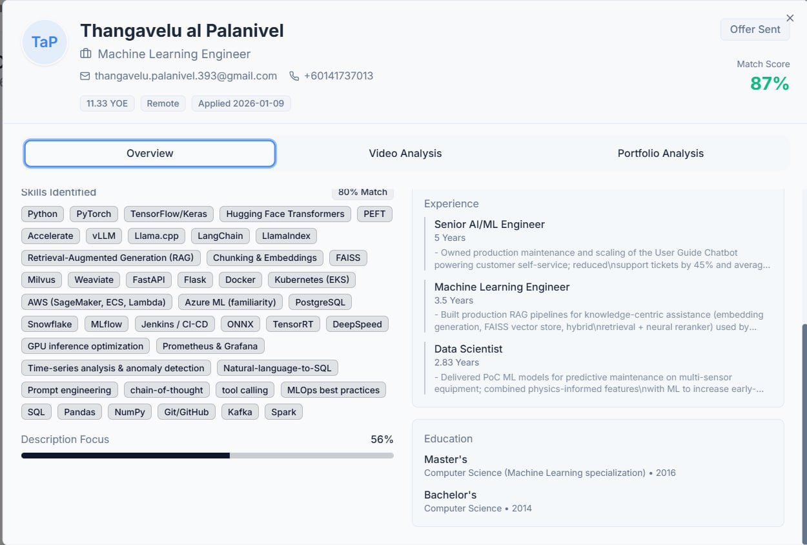
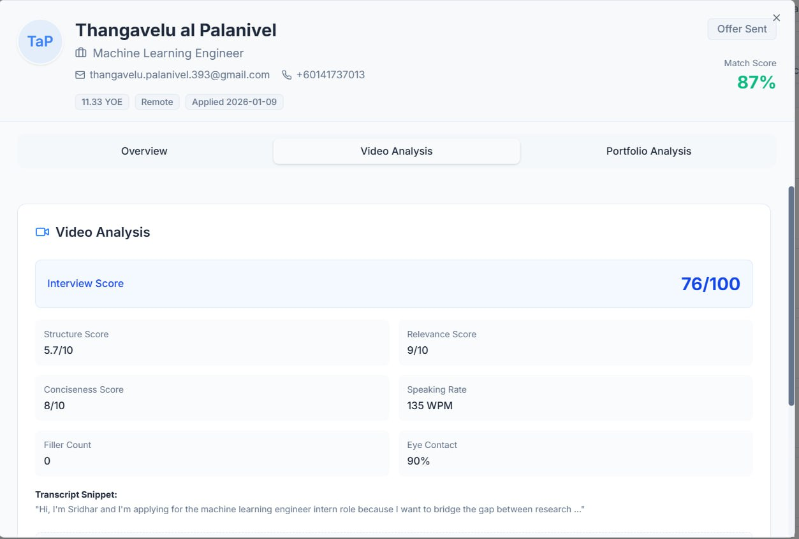
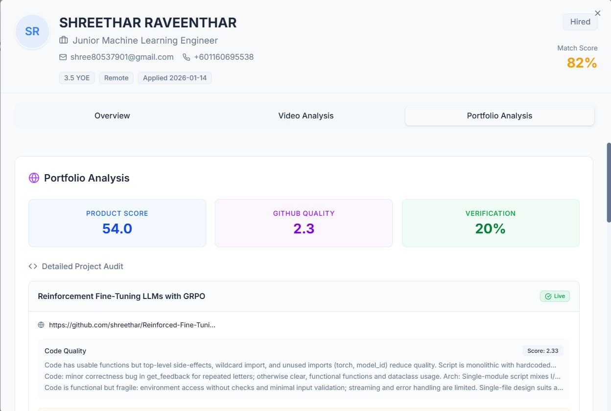
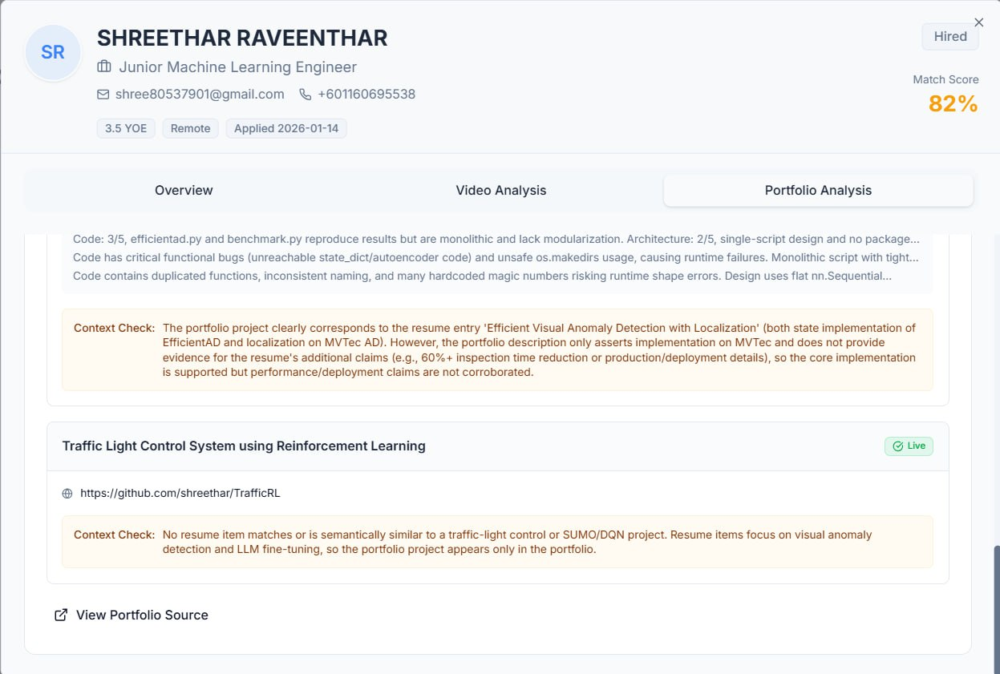
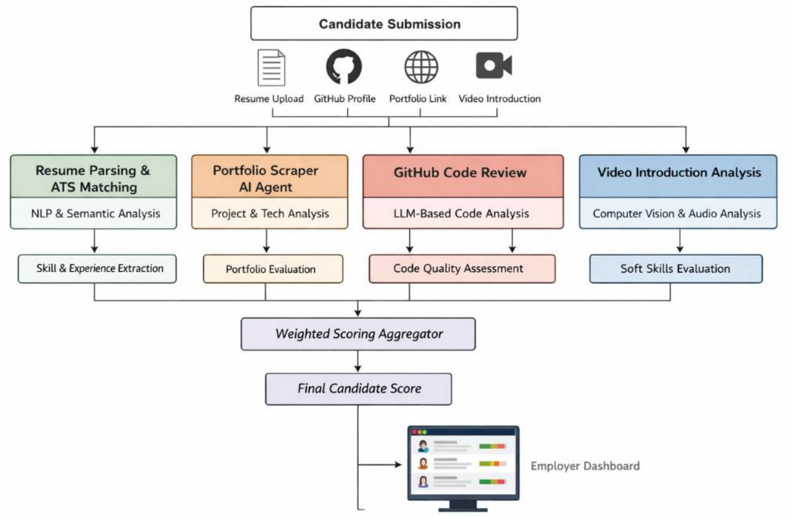

<div align="center">
  
  <h1>🚀 DeepScreen</h1>
  <p><strong>The AI-Native, Multi-Agent Recruitment & ATS Platform</strong></p>

  <p>
    <a href="https://nextjs.org/"></a>
    <a href="https://fastapi.tiangolo.com/"></a>
    <a href="https://python.org"></a>
    <a href="https://react.dev/"></a>
    <a href="https://tailwindcss.com/"></a>
  </p>
</div>

---

**DeepScreen** is a next-generation Applicant Tracking System (ATS) that leverages a swarm of AI agents to autonomously evaluate candidates. It goes beyond keyword matching by performing semantic resume ranking, deep web auditing of candidate portfolios, and biometric-aware video interview analysis.

## ✨ Key Features

- 🧠 **Gen4 ATS Ranking**: Semantic matching and LLM-powered Merge Sort ranking to find the perfect fit between resumes and Job Descriptions.
- 🕷️ **Intelligent Web Auditor**: An autonomous agent that crawls candidate portfolios and GitHub/LinkedIn profiles to verify technical claims.
- 🎥 **Video Behavioral Analysis**: Analyzes facial landmarks, engagement, and communication skills during video interviews using MediaPipe and AI.
- 📊 **Unified HR Dashboard**: A beautiful, real-time Next.js 16 interface with Radix UI, managed via Firebase.
- ⚡ **Microservice Architecture**: Fully decoupled FastAPI backends for processing scalability.

## 📸 UI Showcase

<details open>
<summary><b>1. HR Dashboard Analytics</b></summary>
<br>

<i>Real-time analytics showing total candidates, match scores, and recruitment funnel progression.</i>
</details>

<details>
<summary><b>2. Active Job Management</b></summary>
<br>

<i>Effortlessly manage active job listings and monitor the influx of candidates per position.</i>
</details>

<details>
<summary><b>3. Candidate Pipeline & Ranking</b></summary>
<br>


<i>Intelligent candidate list ranked via a custom <b>LLM Merge-Sort algorithm</b>. Rather than relying on static keyword scores, the AI dynamically compares two candidates head-to-head against the Job Description. By utilizing a Divide and Conquer Merge Sort, we achieve a time complexity of <b>O(n log n)</b> instead of the typical O(n²) required by Bubble Sort. This drastically reduces the number of expensive LLM API calls while guaranteeing a highly accurate, human-like relative ranking (with an acceptable space complexity tradeoff of O(n)).</i>
</details>

<details>
<summary><b>4. Candidate Profile Overview</b></summary>
<br>

<i>Deep AI-driven insights detailing skill matches, experience extraction, and overall suitability.</i>
</details>

<details>
<summary><b>5. AI Video Interview Analysis</b></summary>
<br>

<i>Detailed biometric and transcript analysis yielding scores for structure, conciseness, and engagement.</i>
</details>

<details>
<summary><b>6. Autonomous Web & Portfolio Audit</b></summary>
<br>



<i>The Scraper Agent acts as an autonomous auditor consisting of a Brain, Hands & Eyes, and a Nervous System orchestration layer. It actively crawls candidate GitHubs and portfolios, performing a 5-step live context check to classify resume claims as True, Exaggerated, or Fabricated.</i>
</details>

## 🏗️ Architecture

DeepScreen operates on a decoupled microservices architecture, utilizing four parallel AI analysis engines to evaluate candidates across multiple dimensions. All insights are aggregated into a final weighted score displayed on the employer dashboard.

<div align="center">
  
</div>

## 💻 Tech Stack

DeepScreen is powered by a robust stack of modern frameworks and AI libraries:

### Frontend
- **Framework**: Next.js 16, React 19, TypeScript
- **Styling**: Tailwind CSS, Radix UI
- **Backend-as-a-Service**: Firebase (Auth, Firestore, Storage)

### Backend Services (Python 3.12)
- **API Framework**: FastAPI, Uvicorn, Pydantic
- **Database ORMs/Drivers**: SQLAlchemy, PyMongo
- **Document Parsing**: PyMuPDF
- **Web Scraping**: Playwright (`playwright-stealth`)

### AI & Machine Learning
- **LLM Orchestration**: LangChain, LangGraph
- **Models & Inference**: OpenAI, Ollama, HuggingFace, Transformers
- **Embeddings**: Sentence-Transformers
- **Audio Processing**: Faster-Whisper
- **Computer Vision**: OpenCV, MediaPipe
- **Data Science**: NumPy, Pandas, Pillow, Scikit-Learn, SciPy
- **Deep Learning Framework**: PyTorch (`torch`, `torchvision`)

## 📂 Project Structure

```text
DeepScreen/
├── web/                  # Next.js 16 Frontend (Dashboard)
│   ├── app/              # React Server Components & Routing
│   ├── components/       # Radix UI & Tailwind Components
│   └── lib/              # Firebase & API clients
├── Resume_Ranking/       # FastAPI Service (Port 8002)
│   ├── llm_ranking.py    # LLM Merge Sort Algorithm
│   └── main.py           # ATS Endpoints
├── Scraper_Agent/        # Autonomous Web Crawler
│   ├── audit_graph.py    # LangGraph State Machine
│   └── main.py           # CLI Entrypoint
└── Video_Analysis/       # FastAPI Service (Port 8001)
    ├── facial_analysis.py# MediaPipe Face Landmarker
    └── main.py           # Stateless Video Processing
```

## 🚀 Quick Start

### Prerequisites

- Node.js >= 18.x
- Python >= 3.10
- Firebase Project configured
- `uv` Package Manager (Recommended for Python)

### 1. Scraper Agent Service (Backend)

Navigate to the `Scraper_Agent` directory and start the web crawling API:

```bash
cd Scraper_Agent
# Install dependencies from root
pip install -r ../requirements.txt
# Run the server
uvicorn api:app --host 0.0.0.0 --port 8000 --reload
```

### 2. Video Analysis Service (Backend)

Navigate to the `Video_Analysis` directory and start the video processing API:

```bash
cd Video_Analysis
# Ensure MediaPipe models are downloaded
uvicorn main:app --host 0.0.0.0 --port 8001 --reload
```

### 3. Resume Ranking Service (Backend)

Navigate to the `Resume_Ranking` directory and start the FastAPI service:

```bash
cd Resume_Ranking
# Run the server
uvicorn main:app --host 0.0.0.0 --port 8002 --reload
```

### 4. Next.js Dashboard (Frontend)

Navigate to the `web` directory to boot up the HR dashboard:

```bash
cd web
npm install
npm run dev
```

The application will be accessible at `http://localhost:3000`.

## 🔐 Configuration & Environment Variables

DeepScreen relies on external APIs. We have provided example environment files that you can use as a template.

1. **Root Backend Configuration**:
   Copy the `.env.example` file in the root directory to `.env` and fill in your keys:
   ```bash
   cp .env.example .env
   ```

2. **Frontend Configuration**:
   Navigate to the `web` directory, copy `.env.local.example` to `.env.local`, and fill in your Firebase details:
   ```bash
   cd web
   cp .env.local.example .env.local
   ```

*Note: For Firebase Admin SDK access in Python, ensure `serviceAccountKey.json` is placed in the root directory.*

## 🗄️ Firestore Database Schema

To ensure the Next.js frontend and Python AI backends sync perfectly, set up your Firebase Firestore with the following core collections:

### 1. `jobs` (Collection)
Stores active job listings created by the HR team.
- `title` (string)
- `description` (string)
- `status` (string) - e.g., "open", "closed"
- `recruiterId` (string) - User ID of the recruiter
- `applicantCount` (number)
- `maxApplicant` (number)
- `createdAt` (timestamp)

### 2. `applications` (Collection)
The core collection where candidate submissions are tracked and progressively updated by the AI processing pipeline.
- `jobId` (string) - Reference to the job
- `applicantId` (string) - User ID of the candidate
- `applicantName`, `applicantEmail`, `applicantPhone` (string)
- `resumeUrl` (string) - Firebase Storage URL to the uploaded PDF
- `visumeUrl` (string) - Firebase Storage URL to the uploaded video
- `pipelineState` (string) - Tracks processing status: `submitted` → `filtered` → `semantic_scored` → `llm_ranked`
- **`layer1` (map)**: Hard-constraint ATS filtering results (`qualified: boolean`, `reasons: array`)
- **`layer2` (map)**: Semantic matching results (`semanticScore: number`, `semanticRank: number`)
- **`layer3` (map)**: LLM Merge Sort results (`llmScore: number`, `finalRank: number`, `explanation: string`)
- `submittedAt` (timestamp)

### 3. `interviews` (Collection)
Tracks scheduled interviews for candidates who successfully pass the AI screening phase.

## 🛡️ Security & Privacy

DeepScreen processes sensitive PII (Personally Identifiable Information). 
- **Stateless Video Processing**: The video analysis service processes files in temporary storage and purges them immediately after execution.
- **Secure Credentials**: All API keys and Firebase credentials must be ignored via `.gitignore`.

---
<div align="center">
  <i>Built with ❤️ for the future of HR technology.</i>
</div>
